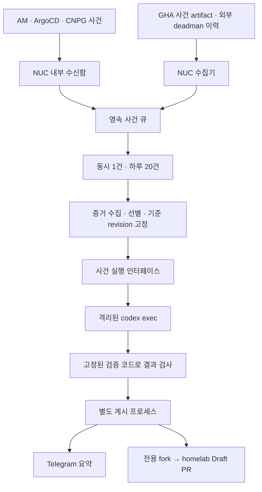

# 비대화형 Codex AIOps — 최종 설계안

Status: needs-info
Updated: 2026-09-12

Q1~Q12의 사용자 선택을 구체화한 **검토용 설계**다. 아래 기본값과 수용 기준을 포함해 공유
이해를 확인한 뒤 구현한다. 확정 요구는 [spec.md](spec.md), 소스와 공식 문서 근거는
[research.md](research.md), 권한 경계는 ADR-0008·ADR-0009에 있다.

**개발 순서 확정:** 사용자는 `codex exec`로 AIOps 파일럿을 먼저 진행하고 Polyrelay는
후속 연결하기로 선택했다. [별도 평가](deferred-polyrelay.md)의 Polyrelay 선행 개발은
파일럿 범위에서 제외한다. 아래 설계는 직접 실행 기준이며 Q1~Q12의 산출·권한은 유지한다.
구체 작업과 의존성은 [구현 작업 목록](implementation.md)에 있다.

## 1. 운영자가 받는 결과

모든 기존 장애 통지를 수집하고, NUC의 전용 계정에서 Codex를 비대화형으로 실행한다.
결과는 Telegram 진단 요약과 homelab의 Draft PR이다. PR head는 전용 fork에만 쓴다.
같은 구독에서 동시 1건·하루 최대 20건을 처리한다. NUC 완전 중단 중의 AI 진단은 범위 밖이다.

진단의 원인 후보마다 관측 근거·반증·부족한 증거를 붙인다. 수정 근거가 있고 검증 가능한
경우에만 PR을 낸다. 원인이 외부 앱 코드, 자격 갱신, 물리 장애, 관측 불가라면 보고서에
그 사실과 다음 확인을 남긴다. PR 개수 증가를 성공 지표로 삼지 않는다.

## 2. 처리 구조

수신함·큐·작업 감독은 NUC systemd에서 운영한다. 클러스터에는 기존 통지의 사건 전달
설정과 최소 접근 정책을 추가한다. GHA와 외부 서비스의 사건은 NUC가 pull하므로 이를 위해
공개 수신 endpoint를 만들 필요가 없다. 내부 수신 포트는 실제 예약·NodePort·ephemeral 범위를
대조해서 정하고, 정해진 내부 발신 경로만 허용한다. 원래 Telegram 알림은 AI 처리와 독립적이다.

역할은 같은 코드베이스로 관리하되 실행 권한을 구별한다.

| 역할 | 필요한 권한 | 역할에 주지 않는 권한 |
|---|---|---|
| 수집·큐 | 사건 쓰기, 제한된 K8s/관측/GitHub/호스트 조회 | 운영 리소스 변경·PR 머지 |
| Codex | 선별한 증거와 작업용 homelab 읽기·쓰기, 구독 인증을 사용하는 엔진 | 운영 kubeconfig·GitHub 게시 키·Telegram 토큰·SOPS 복호 키 |
| 검증 | 후보 변경과 고정된 검증 도구의 격리 실행 | 운영/API 게시 자격·Codex 인증 |
| fork 게시 | 전용 fork의 Contents/Workflows write | upstream Contents write |
| PR·통지 게시 | homelab Pull requests write와 Telegram 송신 | upstream Contents write·클러스터 변경 |

GitHub의 권한 단위는 명령 하나만 허용하는 수준은 아니다. publisher 자체가 repo ID·base·head·
branch prefix·Draft 여부를 고정하고, 모델이 임의 API 요청이나 게시 대상 URL을 지정하지 못하게 한다.

사건 실행 인터페이스는 선별 증거·고정 source revision·시간/출력 한도를 입력으로 받고,
진단·선택적 변경 산출물·종료 상태·확인된 사용량을 반환한다. Codex 명령행과 JSONL 해석은
이 경계 안에 둔다. 첫 구현은 `codex exec` 하나이며, 큐·수집·게시를 Polyrelay protocol에
묶지 않는다. Polyrelay 구현체나 자동 fallback은 이번 파일럿에 추가하지 않는다.

## 3. 모든 장애 통지의 정의와 수집

**전체**는 아래 기존 생산자들의 장애·경고 종류를 빠짐없이 지원한다는 뜻이다. 데이터 수집이
실패하거나 보존 기간 밖의 사건이면 그 구간을 명시한다. 수집되지 않은 사건을 정상으로 표시하지 않는다.

| 생산자 | 수집 방식 | 구별할 사례 |
|---|---|---|
| Alertmanager | 기존 통지에 인증된 사건 webhook을 함께 전송 | firing/resolved/group 재통지; Watchdog는 경로 상태 증거로만 사용 |
| ArgoCD | health-degraded와 sync-failed trigger에서 사건 전달 | Healthy+Synced여도 hook 실패 가능 |
| CNPG 직접 통지 | restore-drill·ensure-role-password 실패 송신 지점에서 사건 전달 | 일반 KubeJobFailed가 잡지 않는 실패 |
| GitHub Actions | 공통 통지 action의 비민감 사건 artifact를 API로 pull | 성공 run 안의 drift·만료·준비상태 경고 |
| 외부 healthchecks | read-only API로 상태 전이 이력 pull | NUC 생존 중 관측 파이프라인 단절 |

호스트 systemd 실패는 기존 textfile→AM 경로에 포함한다. 수집기 시작 시 현재 상태를 대조하고
이후 event ID/cursor로 이어간다. poll 성공과 사건 없음은 별도로 기록한다. source별 수신·조회
신선도와 마지막 경로 검증 시각을 남긴다. 생산자가 추가되면 공통 사건 계약에 연결됐는지 검사한다.

수신함은 사건을 디스크에 기록한 뒤 성공을 응답한다. 재송신은 같은 event ID로 중복 제거한다.
AM의 native 재시도만으로 영구 무손실을 주장하지 않는다. 생산자·수신 경로의 일시 중단은
가능한 이력으로 보충하고, 복원할 수 없는 구간은 누락으로 표시한다. 기존 장애 통지는 수신함 장애로
막히지 않아야 한다. 사건 전송 실패 자체도 관측 가능해야 한다.

GHA artifact는 title/body를 그대로 복제하지 않고 source·severity·reason code·대상·run·revision·
발생 시각 같은 선별 필드만 쓴다. fork PR이 만든 임의 artifact를 신뢰된 main 생산자의 사건으로
받지 않는다. 허용 workflow 신원·event 종류·실행 revision과 원본 run을 확인한다.

외부 healthchecks는 프로젝트별 read-only 키로 상태와 상태 전이를 읽을 수 있다. 키는 기존 ping
URL과 별개이며 아직 준비 여부를 확인하지 않았다. 해당 API가 없으면 외부 deadman 수집은 미배선으로
남으며 전체 범위 완료로 판정하지 않는다. [공식 API](https://healthchecks.io/docs/api/)

## 4. 사건·실행·게시 상태

실제 장애의 상태와 AI 작업 상태를 분리한다. 진단 완료나 PR 생성은 장애 해소가 아니다.

| 상황 | 처리 |
|---|---|
| 같은 알림 재통지 | 같은 사건에 관측을 추가. 새 실행을 무조건 시작하지 않음 |
| 서로 다른 원인의 동시 알림 | 대상이 같다는 이유만으로 합치지 않음. 출처·객체·revision·실패 종류가 맞을 때만 연결 |
| 대기 중 장애 해소 | 기록을 해소로 갱신하고 자동 수정 실행을 취소. 원래 해소 통지는 유지 |
| 분석 중 해소·배포 revision 변경 | 게시 전에 상태와 기준 SHA 재확인. 오래된 수정안을 새 상태의 해결책으로 게시하지 않음 |
| PR 후 반복 또는 해결 | 기존 사건·PR에 연결. 새 PR을 계속 생성하지 않으며 해결 관측과 PR 상태를 따로 기록 |

실행은 queued→collecting→running→validating→published 또는 needs-evidence/failed/deferred로
기록한다. 프로세스 사망 시 lease를 회수하고 실행 결과를 모르는 상태를 성공으로 처리하지 않는다.
후보 patch와 결과 manifest의 hash를 검증 시점에 고정하고 publisher는 그 산출물만 받는다.

PR 생성 응답이 끊기면 fork branch·사건 마커로 먼저 기존 PR을 찾는다. 존재 여부가 불확실하면
다시 만들지 않고 게시 대기로 남긴다. Telegram도 게시 상태를 따로 기록하므로 Telegram 실패가
모델 재실행이나 중복 PR 생성으로 이어지지 않는다.

## 5. 실행 기본값 제안

| 항목 | 초기값과 의미 |
|---|---|
| 일일 슬롯 | Asia/Seoul 자정 기준 20회. 진단·초안 생성을 한 사건 실행으로 계상. 재시도도 슬롯 소비 |
| 동시성과 상한 | 전체 Codex 작업 동시 1건. 사건 실행의 Codex 단계 합계 10분 상한 |
| 재시도·대기 | 공급자 실행 전 실패로 확인된 일시 오류만 자동 재시도 최대 1회. 실행 여부·과금 결과가 불명이면 자동 재시도하지 않음. 인증 만료·구독 한도는 회복까지 대기. API 과금으로 전환하지 않음 |
| 우선순위 | critical 우선, 장기 대기 사건도 처리 기회를 부여. 초과분은 영속 대기와 한 번의 묶음 통지 |
| 자기 반복 | AIOps 자체 통지와 자신의 PR CI 실패는 원 사건에 연결. 자동으로 새 사건의 AI 실행을 무한 생성하지 않음 |

NUC 자원은 정상적인 기동·검증 실측으로 정한다. Codex 작업의 초기 감독 상한 제안은 메모리
2GiB·CPU 2코어 상당이며 OOM/시간 초과는 실패 결과다. 한도 자동 확대 대신 측정과 설정 변경으로
조정한다. 호스트 서비스 자원도 상주 워크로드 계상·관측에서 누락되지 않게 한다. 기존 메모리 cap을
AIOps 편의를 위해 자동 변경하지 않는다.

사용 모델은 설치 시 구독에서 이용 가능한 Codex 모델 하나를 명시해 기록한다. CLI·모델·프롬프트·
스키마 버전과 사용량을 실행 기록에 남기고 변경 시 동일 fixture로 회귀를 확인한다.
구독은 운영자의 다른 Codex 사용과 한도를 공유할 수 있으며, 하루 20회가 특정 토큰량을 보장하지 않는다.

## 6. 증거·지식·민감정보

수집기는 사건 발생 전 15분부터 수집 시점까지를 기본 창으로 시작한다. metrics/log query의
시간·해상도·필터·source revision·수집 실패·잘린 부분을 함께 기록한다. 기본 로그는 컨테이너당
최대 200줄, 모델 입력용 증거는 합계 256KiB부터 시작하고 잘리면 부족한 증거로 표시한다.
권한·상태·로그 등 K8s 객체의 원문 전체를 무조건 모델에 전달하지 않는다.

핵심 입력은 관련 상태·메트릭·이벤트·선별 로그, homelab 기준 revision과 최근 관련 변경,
해당 자산의 현행 ADR·함정·검증된 런북 조각이다. 과거 runbook과 현재 기판/코드가 충돌하면
충돌 사실을 보고한다. 시드와 수렴 자산을 구별한다.

원본 로그의 credential·연결 문자열·Authorization·개인정보·private URL은 입력 전에 필드 선택과
마스킹을 적용한다. 패턴 마스킹만으로 모든 비밀을 찾는다고 보장하지 않는다. 형식을 판별할 수
없는 원문은 빼고 무엇을 보지 못했는지 표시한다. 비신뢰 로그의 명령문은 실행 지시가 아니다.

로컬 사건/진단 기록은 30일, 선별 증거와 원시 실행 로그는 7일 보관을 초기값으로 제안한다.
디스크 사용량 상한과 자동 정리를 둔다. 인증 파일·키·원본 Secret은 사건 저장소에 넣지 않는다.
public fork·PR에는 원본 로그·증거 파일·내부 런북을 첨부하지 않는다.

## 7. Codex 실행과 검증

작업 감독기는 신뢰된 운영 코드에서 실행한다. Codex는 선별 증거와 고정된 homelab 작업 사본으로
진단 및 수정 초안을 만든다. 사용자 개인 홈·기존 MCP 전체·hooks·게시 자격을 상속하지 않는다.
운영 클러스터 직접 도구는 수집기 소유이고 Codex는 그 결과를 소비한다.

진단과 수정의 단계는 구별하되 사건 실행 전체에 예산을 적용한다. 구조화된 최종 결과와
JSONL 실행 기록을 분리한다. 출력 JSON 형식이 맞는다는 사실만으로 근거나 검증이 맞다고
보지 않는다. 프로세스 종료·산출물 존재·schema·base SHA·patch·evidence 참조를 각각 확인한다.

구독 인증은 전용 실행 계정에서 로그인하고 갱신 상태를 유지한다. Codex 엔진이 사용하는 인증과
모델이 실행하는 명령의 파일 접근은 별도로 검증해야 한다. 전용 계정만 만들었다고 인증 캐시가
명령에서 보이지 않는 것은 아니다. 실제 CLI의 읽기 제한과 sandbox 동작은 배선 수용 조건이다.
auth는 갱신될 수 있어야 하며 API 키로 자동 우회하지 않는다.

Codex의 새 permission profile로 작업공간과 최소 실행 파일만 허용하고 인증/게시 경로의 읽기를
차단한다. legacy `--sandbox`·`sandbox_mode`와 섞지 않는다. hooks·MCP·플러그인을 자동 상속하지
않도록 실제 유효 설정을 검증하며, 승인 정책은 `never`로 고정한다. 기능은 Beta이므로 이름만
설정했다고 격리가 됐다고 보지 않는다. [공식 Permissions](https://learn.chatgpt.com/docs/permissions)

활성화 검사는 모의 인증 파일로 수행한다. 허용 작업공간 읽기/쓰기 성공과 직접 경로·symlink·
상속 FD/환경변수·credential socket·부모 프로세스 경유 접근·임의 네트워크의 거부를 확인한다.
sandbox 초기화 실패나 우회가 있으면 실제 인증으로 사건 처리를 시작하지 않는다.

검증기는 후보가 바꿀 수 없는 신뢰된 기준 revision의 검사 진입점을 사용한다. 후보 테스트를
실행할 때도 운영 자격과 게시 자격은 없다. 변경 종류에 맞는 기존 chart/ledger/tooling/정적
검사를 실행하고 실제로 하지 않은 live·시크릿·Terraform 검증을 명시한다. 후보 CI를 바꾼 경우
그 후보의 gate 성공과 기존 gate 기준 검증을 구별한다.

설계 선택은 모든 파일의 **초안**을 허용한다. 기존 규약상 암호화 파일은 SOPS 절차로만
바뀔 수 있고 평문 비밀을 모델에 제공하지 않는다. 암호화 키 없이는 유효한 초안을 만들 수 없는
변경은 owner 작업으로 남긴다. 파괴적 설정·ADR 변경·정책 완화가 필요하면 PR에서 명시적으로 표시한다.

## 8. GitHub·Telegram 게시

fork 전용 게시 자격과 upstream PR 자격을 분리한다. 권장안은 별도 GitHub App 두 개이며
fork 쪽에만 Contents/Workflows write, upstream 쪽은 Pull requests write와 필요한 읽기 권한을
준다. 기존 광역 writer의 PEM을 NUC에 옮겨 재사용하지 않는다. App 설치 범위와 실제 토큰 범위를
모두 좁히고, 키는 Codex/검증 프로세스가 읽지 못하는 게시 역할에만 둔다.

publisher는 작업 사본의 `.git` 설정이나 hooks를 신뢰하지 않는다. 검증된 patch를 깨끗한 게시
사본에 적용하고, 고정 repo ID·base main·전용 fork·`aiops/<incident-id>`를 확인한다.
Draft로 제출하고 자동 머지·ready 전환·운영 디스패치는 하지 않는다. fork 자체 Actions는 끄고
upstream의 fork PR 검증을 사용한다. NUC는 GitHub Actions의 self-hosted runner로 등록하지 않는다.

PR 본문은 관측한 문제, 수정 이유, 검증 결과와 미검증 항목, 주의할 적용 효과를 담는다.
Telegram은 원인 후보·다음 행동·PR 링크를 요약한다. 수정안이 없으면 보류 이유와 다음 확인을 보낸다.
한국어 conventional commit과 AI 마커 금지 규약을 따른다.

## 9. 수용 기준

| 축 | 파일럿 시작 전에 확인할 증거 |
|---|---|
| 통지 범위 | 5개 생산자 계열을 전부 연결. ArgoCD hook 실패·CNPG 직접 FAIL·성공 GHA 안 경고가 사건으로 도착 |
| 권한 격리 | 모의 비밀 파일 읽기/임의 외부 쓰기/운영 변경이 거부됨. fork PR에 upstream 시크릿이 제공되지 않음 |
| 실행 신뢰성 | 반복·역순·해소·구독 실패·timeout·재시작·quota 초과·게시 응답 유실에서 거짓 성공과 중복 PR이 없음 |
| 진단과 수정 | 최소 12개 고정 사례에서 모든 결론에 근거 참조. 관측 부족/외부 앱 원인/패치 불필요를 올바르게 보류 |
| 검증 경계 | 정상 수정과 금지된 실행·민감정보 유출·gate 약화 후보를 구별. 실제 fork Draft PR에서 gate/plan 생략 동작 확인 |

12개 사례는 적어도 위 통지 5종, 관측 누락, 낡은 SHA, 로그 내 지시문, secret 유사 입력,
반복 사건, 분석 중 해소, 진단 근거가 있는 수정안을 포함한다. 사후 정답 문서를 모델 입력에서
분리한다. 알림 합성 테스트를 그대로 완성된 진단 평가라고 부르지 않는다.

실제 알림 파일럿은 14일 관찰을 제안한다. 각 사건의 수동 확인 시간·초안 검토 시간·오진·보류·
사용량을 기록한다. 사건이 충분하지 않으면 14일 경과만으로 효과 입증을 선언하지 않는다.
수정 초안의 유용성 목표는 운영자가 독립 재조사 없이 다음 조치를 고를 수 있는 보고가 되는 것이다.

## 10. 구현과 사용자 작업

구현 순서는 사건 수집→증거 수집→격리 실행→게시→전체 수용 시험이다. 검토용 작업 티켓은
`.scratch/aiops-codex/issues/`에 준비했다. 최종 공유 이해 확인 뒤 구현에 착수한다.
실행 코드는 기존 Bun/TS 도구 계층,
호스트 배선은 `infra/k3s-bootstrap`의 systemd 계층, 클러스터 통지 설정은 해당 platform에 둔다.
새 도구/정책/매니페스트는 기존 문서 로스터와 관련 gate에 편입한다.

사용자가 직접 해야 할 초기 작업은 전용 계정의 Codex 로그인, fork/App 설치 승인,
healthchecks read-only 키 발급이다. 예상 사용자 작업은 20~40분이며 필요한 설정과 검증기를
먼저 준비한 뒤 안내한다. 값은 채팅으로 받지 않는다. 호스트 계정·유닛·자격 배치와 활성화는
검토 가능한 설치 절차로 준비한다. 일반 host-config 적용이 자동 enable을 하지 않는 기존 규약은 유지한다.

기존 메모리 원장·wide writer 권한·신뢰 앵커·GitOps 적용 경로를 묵시적으로 바꾸지 않는다.
실측으로 드러나는 배선 문제가 있으면 해당 원인·수정안·검증 결과를 기록한다.
