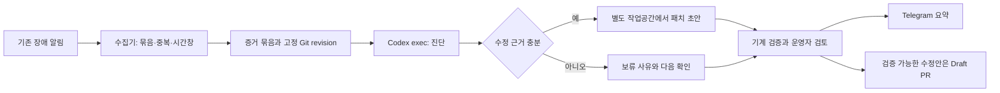

# homelab AIOps 아키텍처 검토

조사일: 2026-09-12. 상태: 설계 근거 및 조건부 제안.
요구·사용자 결정은 [spec.md](spec.md)가 소유한다.

추가 요청인 Polyrelay API 실행 방안은 [비교 평가](deferred-polyrelay.md),
[API 코드 조사](deferred-polyrelay.md), [운영 조건 조사](deferred-polyrelay.md)에
기록했다. 현재 실제 공급자 실행·무인 재활성화·변경 산출물 export의 선행 작업이 있어
즉시 교체를 추천하지 않았다. 사용자는 AIOps 파일럿을 `codex exec`로 먼저 진행하고
Polyrelay는 후속 연결하기로 선택했다. 기존 사용자 결정과 권한 범위는 유지한다.

## 판단

현재 구조에는 알림·관측 저장소·GitOps 수렴·검증 게이트·기계 판독 CLI가 이미 있다.
비대화형 Codex를 넣을 자리는 **장애 증거를 해석하고 검토 가능한 수정 초안을 만드는 단계**다.
첫 파일럿은 이 단계가 운영자에게 유용한지 입증하는 데 집중하는 편이 좋다.
사용자 선택으로 처음부터 모든 장애 알림을 다루며, NUC 생존 장애에 한정한다.
NUC 전용 계정·systemd에서 기존 ChatGPT/Codex 구독으로 실행하고 Telegram과 GitHub PR로 전달한다.
Q11·Q12로 전용 fork에서 homelab 전체 파일의 수정안을 Draft PR로 제출하는 범위가 확정됐다.
아래의 구성요소 분리와 처리 계약은 후속 설계 제안이다.



기존 Telegram 알림은 독립적으로 유지하는 것을 추천한다. AI 장애가 원래 장애 통지까지
막지 않도록 하기 위해서다. AI의 보고서와 초안은 사용자 Q7에 따라 Telegram과 GitHub PR로 전달한다.

## 확인한 현재 구조

### 배포와 실행 권한

- `main`을 ArgoCD가 수렴시키며 root와 ApplicationSet에 prune/selfHeal이 있다.
  근거: `platform/argocd/root/root-app.yaml:14`, `platform/argocd/root/appset.yaml:49`.
  live patch가 되돌아간 실제 기록은 `docs/traps-detail.md:216`이다.
- `homelab mcp`는 진단 전용이 아니다. doctor/status 외에 생성·시크릿 변이와
  자격증명 파일을 쓰는 URL 도구도 노출한다. 근거: `tools/lib/mcp.ts:141`, `:203`, `:240`.
  도구를 읽기 전용으로 쓰라는 프롬프트만으로 이 실행 권한이 줄어들지 않는다.
- 앱 create·teardown은 수동 머지이고 DB/cache 생성·secret 갱신은 자동 머지다.
  근거: `tools/lib/verbs.ts:164`, `:190`, `.github/workflows/_create-database.yaml:90`,
  `.github/workflows/_update-secrets.yaml:82`. PR-first 자체는 사람 검토 보장이 아니다.
  required review 수는 0이다(`infra/github/repo.tf:37`).
- 공개 변이 디스패처는 owner 및 재실행 주체를 검사한다.
  근거: `.github/workflows/create-app.yaml:35`.
  AI 전용 App이 기존 owner-only 디스패처를 호출할 수 있다고 가정할 수 없다.
- 변이와 bump-poll은 `homelab-mutation`을 공유한다.
  근거: `.github/workflows/create-app.yaml:17`, `.github/workflows/bump-poll.yaml:33`.
  진단 추론을 이 직렬화 구간 안에 두면 기존 배포도 AI 실행 시간만큼 기다린다.

### 결과 계약을 읽을 때의 함정

`homelab-cli/1`은 재사용할 좋은 경계다. 다만 **도구 성공, 관측 완전성, 대상의 건강 상태는
각각 다른 사실**이다. `tools/cli-result-schema.json:6`이 variant·exitCode·omitted의 계약이다.

| 관측 결과 | 잘못된 해석 | 진단에서 해야 할 해석 |
|---|---|---|
| success + omitted에 live | 클러스터 정상 | 라이브를 확인하지 못했다 |
| success + live.error | 장애 없음 | 관측 실패이며 원인은 미확정 |
| pending, MCP isError=false | 작업 완료 | 진행 중 또는 완료 여부 불확실 |
| 로컬 repo.head와 live revision이 다름 | 즉시 드리프트 | 출처·시간·배포 과정과 비교해야 함 |

근거: `tools/lib/status.ts:104`, `:299`, `:329`; `tools/cli-result-schema.json:20`.
`status --app`의 의미를 모든 status 모드에 무조건 일반화하지 않는다.

현재 MCP의 bounded는 입력 스키마에 긴 대기 옵션이 없다는 뜻이다. 실제 하위 프로세스의
wall-clock 상한은 없으며 기존 owner 결정이 있다(`tools/lib/mcp.ts:7`). 이 파일럿의 새
수집기·Codex 작업에 감독 상한을 두는 것과 기존 변이 엔진의 timeout을 변경하는 것은 별도다.

### 알림과 증거

| 현재 자산 | 확인한 내용 | AIOps에 주는 제약 |
|---|---|---|
| Alertmanager | Telegram 기본, Watchdog만 deadmanswitch webhook. group_wait 30s, group_interval 5m, repeat 4h | 재통지마다 새로운 사고/추론을 만들지 않도록 묶음 정책 필요 |
| VictoriaMetrics | 30초 scrape, 메트릭 retention 30일 | 수집 구간·해상도·누락을 기록해야 함 |
| VictoriaLogs/Vector | 컨테이너 로그 수집, retention 14일 | 호스트 journal이나 과거 K8s Event가 자동 포함되지 않음 |
| 호스트 journal | 영속 journal, 512M 상한 | 별도 수집 경로·권한·시간창 필요 |
| 단일 NUC | 관측 저장소도 같은 노드·bulk 볼륨에 있음 | 노드/디스크 장애 때 증거 조회도 중단될 수 있음 |

근거: `platform/victoria-stack/prod/alertmanager-config/alertmanager.yml:17`,
`platform/victoria-stack/prod/vmagent-scrape-config.yaml:7`,
`platform/victoria-stack/prod/vmsingle.yaml:50`, `:86`,
`platform/victoria-stack/prod/victorialogs.yaml:47`,
`platform/victoria-stack/prod/vector.yaml:25`,
`infra/k3s-bootstrap/host-config/etc/systemd/journald.conf.d/10-k3s-node.conf:8`.

새 내부 receiver 포트는 기존 NetworkPolicy 변경이 필요하다. 외부 HTTPS는 현재
Alertmanager egress에 허용돼 있다(`platform/victoria-stack/prod/networkpolicy.yaml:35`).
이번 tracked 코드 조사에서 AIOps receiver나 Codex 실행 루프는 발견하지 못했다.

Watchdog→relay→healthchecks.io 경로는 외부 생존 감지의 기반이다. 하지만 외부 감지는
노드 장애 직전의 로그·메트릭 보존을 뜻하지 않는다. 외부 실행기를 두어도 관측 저장소가
죽으면 원인 대신 "현재 관측 불가"를 보고해야 할 수 있다. 상시 사용 가능한 별도 호스트의
존재는 확인하지 않았다. 과거 Mac 런북은 현재 가용성의 증거가 아니다.

## 지식 입력은 선별해야 한다

현행 저장소에도 서로 다른 시점의 지침이 있다. 로컬 `docs/runbooks/observability-bootstrap.md:40`은
OrbStack/mac 및 live auto-sync patch 절차를 담지만 `docs/runbooks/host-substrate.md:3`은
그 기판의 폐기를 명시한다. `docs/traps-detail.md:216`은 live 패치의 selfHeal 충돌을 설명한다.

수집기는 사건에 관련된 현재 매니페스트·채택 ADR·함정·검증된 런북 조각을 전달하고 각
문서의 적용 대상과 확인 시점을 남기는 것이 좋다. 오래된 문서의 권고가 현재 코드와
다르면 모델이 그 차이를 표시하도록 한다. gitignored 런북은 fresh checkout에 없으므로
어떤 지식을 실행기에 공급할지도 별도 계약이다.

`docs/memory-ledger.md:6`에는 정책 cap 10240Mi가 폐기된 VM 기판에서 왔다고 적혀 있다.
합계는 9148Mi(`:438`)이므로 명목 정책 잔여는 1092Mi다. 61052Mi allocatable은
2026-09-03 기록이며 오늘의 실측이 아니다. 정책 잔여·물리 여유·현재 부하는 구별해야 한다.
이 조사에서 cap 변경이나 메모리 재조정은 하지 않는다.

## 비대화형 Codex의 확인된 실행 표면

설치된 `codex-cli 0.154.0`의 `codex exec --help`에서 `--sandbox`, `--json`,
`--output-schema`, `-o`, `--ephemeral`, `--ignore-user-config`를 확인했다.
`codex -a never exec --help`의 파싱도 확인했다. 모델 실행·인증 검사·과금 호출은 하지 않았다.

공식 문서상 `codex exec`는 스크립트용 실행기다. `--json`은 이벤트 JSONL이고,
`--output-schema`는 최종 응답 형태를 지정한다. 이 둘을 별도 산출물로 취급한다.
스키마에 맞는 출력이어도 진단이 사실이라는 보장은 없으므로 근거와 의미를 검증해야 한다.
출처: [OpenAI 비대화형 실행 문서](https://learn.chatgpt.com/docs/non-interactive-mode).

아래는 **호출 형태 예시**이며 프롬프트·스키마·작업공간은 아직 구현되지 않았다.
`aiops` permission profile도 별도 정의·검증이 필요하다. 실제 배치는 [최종 설계안](design.md)을 따른다.

```bash
codex -a never exec \
  --config 'default_permissions="aiops"' \
  --json \
  --output-schema diagnosis-schema.json \
  -o diagnosis.json \
  - < diagnosis-input.txt > events.jsonl
```

진단은 준비한 증거를 읽고, 패치 생성은 작업공간에 쓰는 단계로 구별한다.
실행기 바깥에서 시간 제한·동시 실행 수·입력 크기·비용 예산을 관리한다.
`never`는 승인 질문을 생략하는 설정이지 권한 부여가 아니다. sandbox와 승인 정책은 별도다.
출처: [OpenAI sandbox 문서](https://learn.chatgpt.com/docs/sandboxing).

쓰기 sandbox는 파일 경계를 다루며, 이미 연결한 외부 도구나 자격증명의 서비스 권한을
진단 전용으로 바꿔주지 않는다. 전용 실행 계정·환경으로 개인의 kubeconfig·GitHub writer·
SOPS 키·MCP 설정이 자동 상속되지 않게 설계해야 한다. 일반 worktree 생성만으로 개인
홈 디렉터리나 원격 서비스 접근이 격리되는 것은 아니다.

인증은 사용자 Q4에 따라 기존 ChatGPT/Codex 구독을 사용한다. 공식 문서는 자동화에 API 키를
기본 추천하지만, 헤드리스 계정 로그인도 설명한다. 전용 실행 계정에서 로그인하고 Codex가
갱신한 자격 상태를 영속 보관하는 경로를 우선 검토한다. 공개 레포 CI로 개인 auth cache를
옮기는 설계는 공식 비대화형 문서의 경고와 충돌한다.
출처: [OpenAI 인증 문서](https://learn.chatgpt.com/docs/auth),
[자동화 인증 설명](https://learn.chatgpt.com/docs/non-interactive-mode#authenticate-in-automation).

공식 고급 CI 인증 문서는 같은 auth cache 사본을 사용하는 실행을 한 머신 또는 직렬 작업
흐름으로 제한하고 갱신된 파일을 다음 실행에 보존하도록 설명한다. 이 파일럿은 public 레포
CI에 인증을 싣는 대신 사설 실행 환경의 전용 로그인을 후보로 둔다. 재인증 필요·사용량 제한은
실행 실패/대기로 기록하고 API 자동 전환으로 우회하지 않는다. 실행 계정이 분리되어도 같은
구독의 사용량이 별도 예산으로 분리된다고 가정하지 않는다. 출처:
[OpenAI 계정 인증 유지](https://learn.chatgpt.com/docs/auth/ci-cd-auth).

## 구성 대안

| 실행 위치 | 이점 | 비용과 관측 한계 | 선택 전제 |
|---|---|---|---|
| 전용 계정으로 NUC의 systemd 작업 | 호스트 증거 접근, 클러스터 바깥 프로세스로 실행 가능 | 노드 중단 시 함께 중단; 호스트 자격과 자원 격리 필요 | Q3에서 NUC 생존 전제 수용 |
| k3s Job/worker | 기존 GitOps·리소스 제한·배포 경로 활용 | k3s/노드 장애 때 동작 불가; RBAC·NetworkPolicy·Codex sandbox 적합성 검증 필요 | 대상 장애에서 실행기까지 생존 |
| 별도 호스트/외부 실행기 | NUC 중단 중에도 감지·보고 프로세스 유지 | 호스트 비용·사설망 연결; 외부 증거 보존 없으면 상세 진단 불가 | 별도 실행 자산 확보 |
| GitHub Actions | 실행 이력·artifact·Git 검증과 결합 | 사설 관측 접근과 신뢰 경계, 큐 지연, 공개 레포 데이터 노출 검토 필요 | 인증·입력 전달·게시 범위 합의 |

Q3·Q4·Q6 답변으로 NUC 전용 계정·systemd를 선택했다. 다른 위치는 비교 근거로 남긴다.
Codex는 종료형 작업으로 실행하고, 상주할 수집·큐 관리와 역할을 나누는 것이 적합하다.

## 산출물 및 실행 계약 제안

| 산출물 | 담을 정보 | 판정 주체 |
|---|---|---|
| 사건 기록 | 입력 출처·발생/수집 시각·대상 UID·알림 fingerprint·관련 revision | 수집기 |
| 증거 묶음 | query/기간·필터·출처·관측값·누락/실패·크기 제한·민감값 제거 이력 | 수집기 |
| 진단 | 원인 후보·증거 참조·반증·불확실성·추가 확인 | Codex + 기계 검증 + 운영자 |
| 패치 초안 | base SHA·변경 파일·진단 근거·효과 예상·검증 내역·미검증 항목 | 별도 Codex 작업 + 검증기 |
| 실행 기록 | CLI/모델/프롬프트 버전·시작/종료·usage·종료 이유·artifact 위치 | 실행 감독기 |

원시 로그는 비신뢰 데이터이며 자격·개인정보를 포함할 수 있다. 모델 입력 전에 필요한
필드와 구간을 선별한다. 모델 출력의 임의 셸 문자열을 실행 명령으로 해석하지 않는다.
수정 후보의 검증은 격리된 환경에서 현재 변경 종류에 해당하는 기존 gate를 실행한다.
테스트 자체가 코드를 실행하므로 writer·운영 자격과 분리해야 한다.

초안에서 경로 이탈, 파일 종류, symlink, binary 변경을 기계적으로 검사한다. Q8에 따라
배포 설정으로 수정 범위를 제한하지 않는다. 설정의 의미와 CI 실행 경계를 검사한다. 검증 뒤 base SHA가 바뀌면
기존 결과를 새 패치에 재사용하지 않는다. 원격 게시 단계가 필요해지면 진단/패치 실행기와
게시 자격을 분리하고, 민감한 증거 묶음이 public 레포의 PR·로그로 넘어가지 않게 한다.

부족한 근거로 패치를 만드는 대신 "추가 증거 필요"로 끝나는 경로가 있어야 한다.
예를 들어 로그 접근 실패를 서비스 정상으로, ImagePullBackOff를 임의 이미지 버전 변경으로,
오래된 시드를 live 결함으로 해석하면 안 된다. 자동 신뢰 점수 하나로 변경을 승인하지 않는다.

## 파일럿 평가

첫 단계는 저장된 입력으로 진단과 패치 검증을 재현하고, 이후 실제 알림을 받아 사람과
병행하는 방식이 적합하다. 기간 제안은 14일이지만 조용한 14일을 통과 증거로 삼지 않는다.
최소 사례 수와 합격선은 설계 질문에서 정한다.

| 평가 축 | 확인할 것 |
|---|---|
| 진단 유용성 | 결론을 뒷받침하는 증거가 있는가, 운영자가 다음 확인을 고르는 시간이 줄었는가 |
| 보류 정확성 | 데이터 소실·낡은 revision·원인 불명에서 건강/원인 확정을 거부하는가 |
| 수정 품질 | 초안이 실제 진단을 해결하는가, 허용 범위인가, 기존 검증을 통과하는가 |
| 실행 신뢰성 | 중복 알림·timeout·인증 실패·rate limit·재시작이 과잉 실행과 거짓 성공을 만들지 않는가 |
| 운영 비용 | 건당 시간·토큰·비용, 초안을 검토하는 사람 시간, 오진과 불필요한 초안 수 |

기존 `tests/gates/vmalert-drift-firing-e2e.sh:17`에는 정상 수렴·phantom drift·KSM 소실·
이미지 pull 교착 사례가 있다. `tests/gates/vmalert-memory-nearlimit-firing-e2e.sh:5`에는
캐시 오탐·anon 압박·PostgreSQL shmem 사례가 있다. **합성 시계열 기반 알림 테스트**라서
완성된 장애 진단 데이터셋은 아니다. 사건별 로그·상태·revision fixture와 정답 근거를 보강해야 한다.

평가 입력에 사후 정답 문서를 그대로 제공하면 기억한 해설을 평가하는 셈이다. 당시 이용 가능한
증거를 입력으로 쓰고 사후 원인·처방은 채점용으로 분리한다. 알려진 원인이라도 당시 증거가
부족하면 올바른 답은 확정 진단이 아닌 보류일 수 있다.

## 기존 결정과의 관계

- ADR-0002: GitHub/Tailscale Terraform은 owner 로컬 apply 전용. 이 파일럿에서 무인 apply로 확대하지 않는다.
- ADR-0003: required check는 gate 하나. 초안 검증의 추가 검사는 필요하면 기존 gate 체계에 편입한다.
- ADR-0007: 시드와 수렴 자산은 다르다. Git 변경이 즉시 live 수정이라고 가정하지 않는다.
- `docs/adr/0001`: CLI/MCP/스키마를 거대 descriptor로 합치자는 기각을 AIOps 도입 명목으로 반복하지 않는다.

## 현재 검증 범위

소스·설정·로컬 운영 기록을 읽고 설치 CLI help와 공식 문서를 대조했다. 애플리케이션 코드·
클러스터·워크플로·인증·메모리 원장은 변경하지 않았다. 실제 Codex 작업이나 end-to-end
파일럿은 아직 실행하지 않았으므로 sandbox 적합성·진단 성능·운영 비용은 검증 전이다.

## 후속 조사: 모든 장애 알림의 수집 범위

사용자 Q5의 범위를 만족하려면 Alertmanager 밖의 통지도 수집해야 한다.

| 생산자 | 누락을 막아야 하는 신호 | 권장 접점 |
|---|---|---|
| Alertmanager | 메트릭/로그 기반 장애, 호스트 systemd 실패 | 기존 Telegram과 webhook fan-out; 현재 상태 polling은 대조용 |
| ArgoCD Notifications | Healthy+Synced여도 발생하는 sync hook Error/Failed | 현재 실패 trigger에서 동일 사건을 별도 기록 |
| CNPG 직접 통지 | 복원 드릴 FAIL, 역할 비밀번호 보정 FAIL | 직접 Telegram 송신 지점에서 사건을 함께 보존 |
| GitHub Actions | 실패 run뿐 아니라 성공 job 안의 drift·만료·준비상태 경고 | 공통 통지 action이 비민감 사건 JSON artifact를 남기고 NUC가 pull |
| 외부 deadman | 감시 파이프라인 단절 | NUC 생존 중 단절을 관측할 입력 추가 검토; NUC 중단 중 AI 처리는 Q3 범위 밖 |

ArgoCD의 실제 함정은 `platform/argocd/bootstrap-values.yaml:182`에 명시돼 있다.
CNPG 복구 드릴 실패는 일반 KubeJobFailed에서 빠지고 자체 FAIL 통지가 즉시 신호이며
AM stale은 8.1일 후다(`platform/cnpg/prod/restore-drill-cronjob.yaml:14`).
직접 송신 코드는 `platform/cnpg/prod/restore-drill-script.sh:49`,
`platform/cnpg/prod/ensure-role-password.sh:58`이다.
호스트 systemd는 `scripts/notify-unit-failure.sh:43`의 textfile→AM 경로다.

워크플로에서 telegram-notify 직접 호출 21개, mutation-notify 위임 5개가 확인됐다.
`credential-expiry.yaml:59`처럼 job success 안에 경고가 있기 때문에 실패한 run만 조회하면
전수 수집이 되지 않는다. 공통 접점은 `.github/actions/telegram-notify/action.yml:8`과
`.github/actions/mutation-notify/action.yml:22`다. 기존 통지의 best-effort 특성은 유지하면서
사건 기록 누락을 별도 상태로 남겨야 한다.

이미 Telegram에 전송한 메시지를 Bot API polling으로 모두 되읽을 수 있다고 가정하지 않는다.
메시지 생산 시점에 사건 ID·종류·대상·원인 코드·run/revision·시각을 함께 기록하는 설계가 적합하다.
public GitHub artifact에는 원본 로그·자격·민감한 운영 본문을 넣지 않는다.

권장 수집 모델은 영속 사건 수신함과 cursor/ACK다. 사건은 디스크에 기록한 뒤 수신 성공을
반환하고, NUC의 실행 큐는 사건 ID로 중복을 합친다. 내부 수신함을 클러스터에 둘지 NUC
서비스의 제한된 내부 포트로 둘지는 네트워크·운영 비용을 비교해 구체화한다. 기존 API polling만으로
짧은 발생/해소를 모두 보존했다고 주장하지 않는다. API polling은 bootstrap·누락 대조에 유용하다.

AM API는 읽기 전용 API가 아니며 alert·silence 변이도 제공한다. 수집기에 필요한 접근만
주고 Codex에는 수집된 파일을 전달한다. 근거: `platform/victoria-stack/prod/alertmanager.yaml:56`,
[배포 버전 AM API](https://raw.githubusercontent.com/prometheus/alertmanager/v0.33.0/api/v2/openapi.yaml),
[공식 webhook 계약](https://prometheus.io/docs/alerting/latest/configuration/#webhook_config).

## 후속 조사: 모든 파일의 초안과 PR 실행 경계

사용자 Q8은 파일 범위를 제한하는 안을 채택하지 않았다. 따라서 CI·IaC 파일도 초안 대상이다.
현재 `.github/workflows/iac.yaml:72`는 same-repo PR의 코드를 checkout한 뒤 R2와 Cloudflare
자격을 사용하는 plan을 실행한다(`:93`, `:103`). Draft 여부를 조건으로 제외하지 않는다.
Draft PR 생성만으로도 이 실행이 시작될 수 있다는 사실을 초안 설계에 반영한다.

사용자 Q11에서 **별도 AIOps fork에서 수정 후 homelab으로 Draft PR**을 여는 방식을 선택했다.
공개 fork PR은 base 레포의 시크릿을 받지 않고 토큰도 읽기 전용으로 제한된다.
현재 `iac.yaml:145`는 fork의 시크릿 부재를 예상하고 회계에서 제외한다.
required gate의 실제 fork 실행과 최초 기여자 실행 승인 정책은 배선 시 검증해야 한다.
출처: [GitHub PR 이벤트와 fork 경계](https://docs.github.com/en/actions/reference/workflows-and-actions/events-that-trigger-workflows),
[GitHub Actions 실행 승인 설정](https://docs.github.com/en/repositories/managing-your-repositorys-settings-and-features/enabling-features-for-your-repository/managing-github-actions-settings-for-a-repository).

모든 파일에는 `.github/workflows`도 들어가므로 fork publisher에 Workflows write가 필요하다.
fork publisher와 upstream PR opener를 분리하면 후자에 upstream Contents write를 줄 필요가 없다.
권장 분리는 fork만 Contents+Workflows write, upstream은 Pull requests write다. 두 역할을
같은 광역 App의 PEM으로 민팅하면 그 PEM이 더 넓은 권한을 재발급할 수 있어 격리가 약해진다.
신규 App과 fork의 실제 cross-repo PR 권한 조합은 아직 발급하거나 실행하지 않았다.
출처: [GitHub App 권한](https://docs.github.com/en/apps/creating-github-apps/registering-a-github-app/choosing-permissions-for-a-github-app),
[PR 생성·머지 API 권한](https://docs.github.com/en/rest/pulls/pulls).

fork 역시 공개다. 민감 증거는 로컬에 남기고 공개 가능한 진단 근거와 패치만 올린다.
fork 자체의 Actions는 끄고 upstream PR 검증을 사용하도록 제안한다.
출처: [fork 가시성](https://docs.github.com/en/pull-requests/reference/forks).

기존 writer 키는 로컬 인벤토리에서 Actions 전용이다(`docs/runbooks/token-inventory.md:76`).
이를 NUC에 복사하는 것을 기존 권한의 단순 재사용이라고 간주하지 않는다. 또한 writer 신원은
bump-poll ruleset bypass를 가진다(`infra/github/rulesets.tf:43`). 새로운 AIOps 권한을 별도로
설계하는 이유다. 새 초안 브랜치는 `aiops/`를 쓰면 기존 sweeper·bump 소유 범위와 분리된다.
근거: `.github/workflows/pr-sweeper.yaml:102`, `.github/workflows/bump-poll.yaml:65`.

채택하지 않은 same-repo 대안에서 PR 자체가 변경할 수 있는 `if: draft`만 추가하는 것은 격리가 아니다.
운영 시크릿을 보호 environment/외부 브로커로 옮기고 trusted main의 코드가 승인한 정확한
head SHA를 실행하는 구조까지 필요해 범위가 커진다. environment 보호는 해당 environment의
시크릿에 대한 경계이며 기존 repo 시크릿 전체를 자동 보호하지 않는다.
출처: [GitHub environment 보호 규칙](https://docs.github.com/en/actions/reference/workflows-and-actions/deployments-and-environments).

## 후속 조사: 인증 읽기 차단과 외부 deadman

공식 Codex 문서에는 새 permission profile의 filesystem `deny`가 읽기와 쓰기를 모두
차단하는 설정으로 설명돼 있다. `default_permissions`와 `[permissions.<name>.filesystem]`로
작업공간을 허용하고 인증·게시 자격 경로를 제외하는 구성이 가능하다. 단, legacy `--sandbox`,
`sandbox_mode`, `[sandbox_workspace_write]`를 함께 쓰면 새 profile보다 우선하므로 병용하지
않는다. 기능은 Beta이며 설치된 CLI·NUC 환경에서 실제 enforcement를 검사해야 한다.
출처: [OpenAI Permissions](https://learn.chatgpt.com/docs/permissions).

`--ignore-user-config`는 user config.toml 생략이고 인증 및 모든 설정 계층 제거를 뜻하지 않는다.
hooks·MCP·플러그인의 유효 설정도 확인해야 한다. shell 네트워크 차단과 Codex 엔진의
모델·인증 통신은 다른 경계다. 기본 실행을 승인 질문으로 복구하는 설계는 무인 실행과 맞지
않으므로 경계를 넘는 동작은 거부/보류한다. 출처:
[OpenAI Hooks](https://learn.chatgpt.com/docs/hooks),
[OpenAI 설정 레퍼런스](https://learn.chatgpt.com/docs/config-file/config-reference).

조사 에이전트의 구형 서브커맨드 형태 `codex sandbox linux --help`는 0.154.0에서 sandbox
초기화를 시도했으며 임시 lock 경로 접근 실패로 exit 101이었다. 실제 차단 성공의 증거가 아니다.
실제 모델 실행이나 인증 파일 읽기는 하지 않았다. 정상 help로 현재 sandbox probe 문법을
확인한 수준이며, 활성화 전 가짜 파일을 이용한 NUC 검증이 남는다.

Healthchecks API는 프로젝트별 read-only 키와 상태 전이(`/flips/`) 조회를 제공한다.
read-only 응답은 ping URL 등 대신 `unique_key`를 주므로 원래 ping 비밀을 모델에 넣을 필요가 없다.
이를 사용하면 NUC 생존 중 외부 감시의 단절/회복 이력을 수집할 수 있다. 현재 계정에서
read-only 키가 준비됐는지는 확인하지 않았다. 출처: [Healthchecks API v3](https://healthchecks.io/docs/api/).
